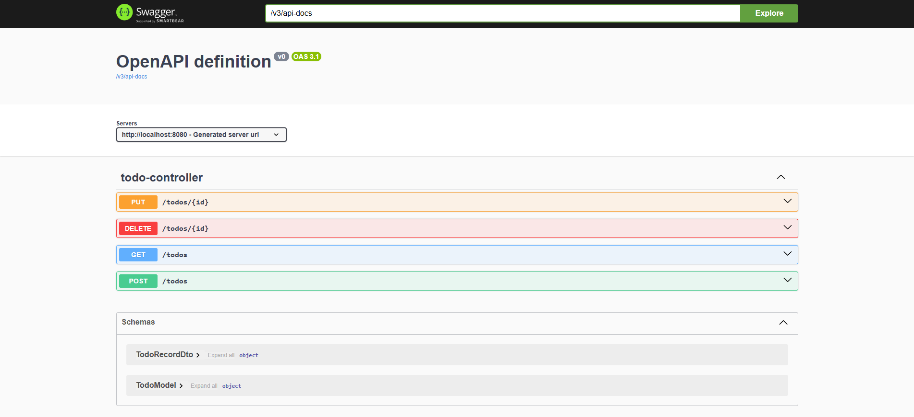

# Java Spring To-Do List

CRUD REST API to practice Spring Boot fundamentals and important dependencies such as Spring MVC and Spring Data JPA.

## Technologies
- [JDK 17.0.9](https://www.oracle.com/java/technologies/javase/jdk17-archive-downloads.html)
- [Spring Boot](https://spring.io/projects/spring-boot)
- [Spring MVC](https://docs.spring.io/spring-framework/reference/web/webmvc.html)
- [Spring Data JPA](https://spring.io/projects/spring-data-jpa)
- [PostgreSQL](https://www.postgresql.org/download/)

## How to Run
- Clone this repository:
```
https://github.com/matheusbloize/java-spring-todo-list.git
```
- Create your PostgreSQL database
- Create .env and add environment variables ([example](https://github.com/matheusbloize/java-spring-todo-list/blob/main/.env.example))
- Build project:
```
./mvnw clean package
```
- Run app:
```
java -jar target/todo-list-0.0.1-SNAPSHOT.jar
```

### Links
API: [localhost:8080/todos](http://localhost:8080/todos)  
Swagger UI: [localhost:8080/swagger-ui/index.html](http://localhost:8080/swagger-ui/index.html)

## API Endpoints
```
GET    /todos  
POST   /todos  
PUT    /todos/{id}  
DELETE /todos/{id}
```


